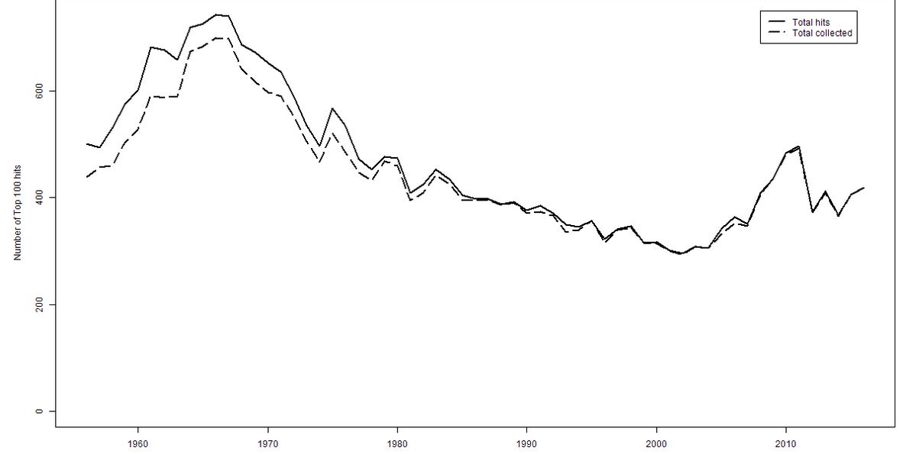
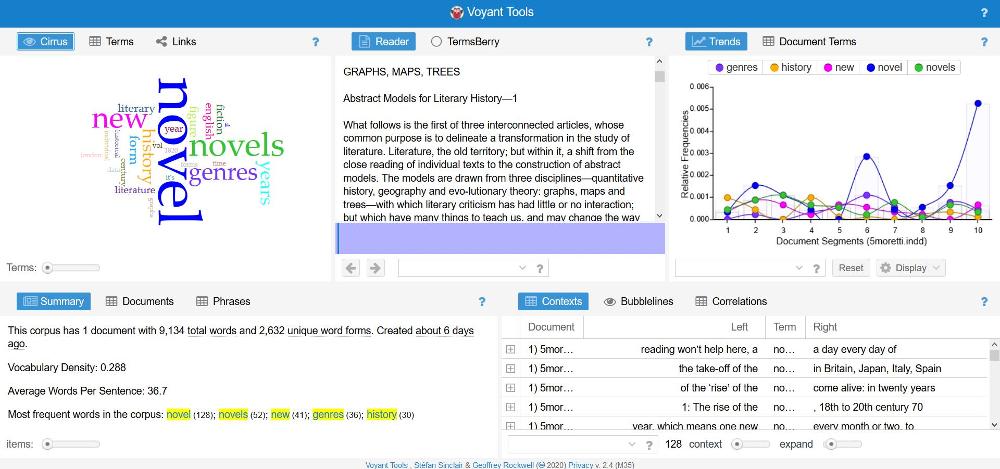

IASC Blog Post 

Both Moretti and Drucker argue that visual forms (e.g. graphs, maps, etc.) can and should be 

used to represent cultural phenomena (e.g. the experience of temporality, rises and falls in genre, 

etc.). Moving between written and visual mediums of expression offers a model for the next 

generation of digital humanities scholarship, where readers are asked to think critically across 

both textual and graphical modes. As such, digital humanities scholarship should increasingly 

create multimodal scholarship where readers interpret both the text and any other media (such as 

graphs, images, audio, and so on). Creating scholarship that asks readers to interpret across 

multiple modes will distinguish digital humanities scholarship from scholarship in the sciences.

An Evolution of Comprehension 

   Digital Humanities is a recent trailblazing field that uses technology to understand and
	
document cultural shifts through trends and patterns. Figures such as Moretti and Drucker, 

digital humanity scholars, suggest that visual forms such as graphs and maps should be used to 

represent these trends and patterns. Moretti and Drucker also suggest there should be an increase 

in multimodal scholarships such as Prism or Voyant as to create easier and more accessible 

routes to understand these often long winded and drawn out readings. I agree wholeheartedly 

with Drucker and Moretti’s viewpoint on needing visual representation to help increase interest 

and attentiveness especially among the younger generation of digital humanities scholars. With 

these long readings of text, there is a risk that many students are not comprehending the material 

or worse, they are slowly losing interest. 

   An increase in multimodal scholarship and visual representation in the humanities isn’t 

only sorely needed but, is also an inevitability. The evolution of the digital humanities is heading 

in this direction as more and more readings are introducing pictures and graphs to help convey 

their point. Franco Moretti for instance litters useful and necessary graphs in his 27-page article 

titled “GRAPHS, MAPS, TREES: Abstract Models for Literary History.” For a university 

student 27 pages of straight text can be intimidating and results in the user losing site of what 

Moretti is trying to convey with his findings. Even for a trained scholar, text may not be the best 

form of communication when you’re examining a wide range of time and a collection of cases. 

Visual representation is needed. In a small excerpt from Moretti’s article he states, 

	“a field this large cannot be understood by stitching together separate bits of knowledge 

	about individual cases, because it isn’t a sum of individual cases: it’s a collective system, 

	that should be grasped as such, as a whole—and the graphs that follow are one way to 

	begin doing this.”(Morreti, 2005)

Moretti brings up the point that digital humanities cases have grown to a scale where visual 

representation is needed to accurately encapsulate and convey entire case studies. Moretti 

introduces graphs, map and trees to his article in order to accommodate the scale to which the 

field has grown to that point. As time goes on information and research will continue to grow 

because the world continues to evolve and in order to adapt to this evolution more multimodal 

scholarships will be needed as well. 

   Articles in the digital humanities are trending towards visual representation because of its 

practicality and efficiency regarding delivery of accurate and easily digestible information. For 

instance, the article “Changes in Lyrical and Hit Diversity of Popular U.S. Songs 1956-2016” 

authored by Peter Meindertsma uses graphs as a necessity to convey the large scale of there 

topic. 

	“Eventually I managed to obtain the lyrics of all but 1% (n=279) of all songs sung in 

	English that charted on the Billboard top 100 charts from 1956 up to and including 2016. 

	This resulted in a corpus of 7.727.622 words in 27.108 song files with an average of 444 

	examined songs per year” (Meindertsma, 2019)
	
Meindertsma has a substantial amount of information collected and research of this magnitude 

would be extremely difficult to convey to an audience without a visual aid. The excerpt on the 

top explains the scope and results of Meindertsma research and the graph below attempts to do 

the same without as much words. However, there is one key difference between the two, with the 

graph the audience can easily identify the trends over the years for themselves, thus erasing any 

potential bias of the author and allowing the audience to think for themselves. 

   Digital humanities is in desperate need of Multimodal scholarships to have simplify 

complicated studies to students. Although graphs and charts help make the articles more 

digestible, there remains many pages of text that students in particular dread. Students still have 

to muddle through many pages of text in order to see if the article addresses their question or 

piques their interest. This is an issue that needs to be addressed and evolve in the future. Text 

analysis tools like Voyant are the future of digital humanities. Voyant is one of the few easily 

accessible and useful tools that break down text-heavy articles and clarifies the main talking 

points and identifies the trends prevalent in the article. This not only allows students to 

understand the overall scope of the article, it also allows students to achieve a little bit of context 

and a brief summary before reading the article. Using Franco Moretti’s article “GRAPHS, 

MAPS, TREES: Abstract Models for Literary History”, one can see the usefulness of Voyant.

Through Voyant prominent words in an article can be identified and grouped together. With this 

information the audience can see the prominent terms in the article and how often they intersect 

with each other. For example, through Voyant one can spot the amount of times hot button words 

such as novel, genres and novels interact. This is huge for students who are looking for a specific 

article that discusses the issues there interested in. This helps students get to the heart of the 

article without deciphering 27 pages of text. More text analysis tools like Voyant need to be 

created in order to help the next generation of digital humanities scholars to succeed.

   Digital humanities scholars Moretti and Drucker are avid supporters of expanding visual 

representation in articles and introducing Multimodal tools to help expand the field. To 

summarize visual representation and Multimodal tools can help students comprehend and keep 

them interested in the field. Bringing more members and students helps grow the field and 

eventually through this growth, evolution and new ideas will take root. 

References 

Moretti, Franco. “Franco Moretti, Graphs, Maps, Trees - 1, NLR 24, November–December 2003.” New Left Review, 

“Changes in Lyrical and Hit Diversity of Popular U.S. Songs 1956-2016.” DHQ: Digital Humanities Quarterly: Changes in Lyrical and Hit 

Diversity of Popular U.S. Songs 1956-2016, digitalhumanities.org/dhq/vol/13/4/000440/000440.html#figure01.

